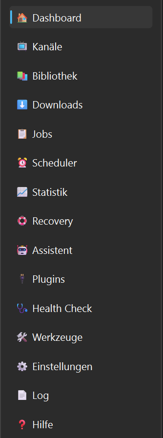

# Kanäle

## Einführung

Die Kanalverwaltung bildet das Herzstück von MediaHub.

Jeder eingerichtete Kanal besitzt seine eigenen Einstellungen, Downloadpfade, Dateinamenschemata und Playlists. Dadurch können beliebig viele Kanäle unabhängig voneinander verwaltet werden.



---

# Einen neuen Kanal anlegen

Ein neuer Kanal kann auf zwei Arten erstellt werden:

- über **Datei → Start-Assistent**
- über **Neu** in der Werkzeugleiste

Für neue Benutzer empfiehlt sich immer der Start-Assistent, da dieser Schritt für Schritt durch die Einrichtung führt.

---

# Kanalname

Der Kanalname dient ausschließlich zur besseren Übersicht innerhalb von MediaHub.

Es empfiehlt sich, den offiziellen Namen des YouTube-Kanals zu verwenden.

Beispiele:

- NASA
- Tom Scott
- Kurzgesagt
- SpaceX

---

# Kanal-URL

Hier wird die Internetadresse des YouTube-Kanals eingetragen.

MediaHub verwendet diese Adresse später für:

- Synchronisierung
- Playlist-Erkennung
- Videoerkennung

---

# Arbeitsordner

Der Arbeitsordner dient als temporärer Speicher.

Hier legt MediaHub unter anderem:

- heruntergeladene Dateien
- Metadaten
- temporäre Informationen

ab.

Der Arbeitsordner sollte sich möglichst auf einer schnellen SSD befinden.

---

# Zielordner

Im Zielordner landen die fertigen Videos.

Von dort können sie beispielsweise automatisch an:

- Plex
- Jellyfin
- Kodi
- NAS

weitergegeben werden.

---

# Dateinamenschema

MediaHub kann Dateinamen automatisch erzeugen.

Beispielsweise:

```
Titel
```

oder

```
Titel (2026)
```

oder

```
Titel - S01E05
```

Je nach gewähltem Schema.

Dadurch bleiben alle Downloads einheitlich organisiert.

---

# Synchronisierung

Während einer Synchronisierung passiert Folgendes:

1. MediaHub liest den Kanal aus.
2. Neue Videos werden erkannt.
3. Bereits bekannte Videos werden übersprungen.
4. Neue Videos werden in der Datenbank gespeichert.
5. Die Downloadauswahl kann geöffnet werden.

Es werden dabei noch keine Videos heruntergeladen.

---

# Videoauswahl

Nach der Synchronisierung erscheint die Videoauswahl.

Hier kann für jedes Video einzeln entschieden werden:

- herunterladen
- überspringen

Dadurch bleibt jederzeit die volle Kontrolle erhalten.

---

# Playlists

Jeder Kanal kann beliebig viele Playlists besitzen.

Diese können:

- einzeln aktiviert werden
- komplett deaktiviert werden
- automatisch synchronisiert werden

Der Playlist-Manager unterstützt dabei die Verwaltung.

---

# Tipps

💡 Für jeden YouTube-Kanal sollte ein eigener Zielordner verwendet werden.

Dadurch bleiben alle Downloads sauber getrennt.

---

💡 Verwende möglichst den Start-Assistenten.

Dieser übernimmt viele Einstellungen automatisch.

---

# Hinweise

⚠ Änderungen an einem Kanal wirken sich nicht auf andere Kanäle aus.

Jeder Kanal besitzt seine eigenen Einstellungen.

---

⚠ Während eines Downloads sollten wichtige Einstellungen nicht geändert werden.

Warte in diesem Fall, bis der Download abgeschlossen ist.

---

# Siehe auch

- Dashboard
- Playlist-Manager
- Downloads
- Scheduler
- Einstellungen