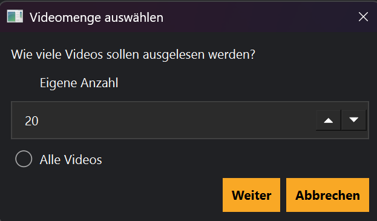

# Erster Download

## Einführung

Dieses Kapitel beschreibt den kompletten Ablauf vom neu eingerichteten Kanal bis zum ersten Download.

Der Ablauf ist besonders wichtig, weil er mehrere Bereiche von MediaHub verbindet:

1. Start-Assistent
2. Video-Mengenauswahl
3. Videoauswahl
4. Download-Warteschlange
5. Bibliothek und Dashboard

## Speichern und starten

Wenn im Start-Assistenten **Speichern und starten** gewählt wird, öffnet MediaHub anschließend die Auswahl für die Videomenge.

Hier legst du fest, wie viele Videos für die erste Auswahl geladen werden sollen.

## Videoauswahl

Nach dem Laden öffnet MediaHub die Videoauswahl.

In diesem Fenster können einzelne Videos ausgewählt oder abgewählt werden.

Typische Aktionen:

- alle Videos auswählen
- einzelne Videos abwählen
- Auswahl bestätigen
- Vorgang abbrechen

## Download-Warteschlange

Nach dem Bestätigen werden die ausgewählten Videos in die Download-Warteschlange übernommen.

Die Warteschlange zeigt den Fortschritt und den Status der Downloads.

## Nach dem Download

Nach einem erfolgreichen Download aktualisiert MediaHub automatisch:

- Bibliothek
- Dashboard
- Datenbank
- Downloadstatus
- Log

## Tipps

💡 Starte beim ersten Test nur mit wenigen Videos.

💡 Prüfe nach dem ersten Download den Zielordner.

## Hinweise

⚠ Wird FFmpeg oder yt-dlp nicht gefunden, kann der Download nicht korrekt starten.

⚠ Downloads können je nach Videoqualität und Internetverbindung längere Zeit dauern.

## Siehe auch

- Start-Assistent
- Videoauswahl
- Downloads
- Bibliothek
