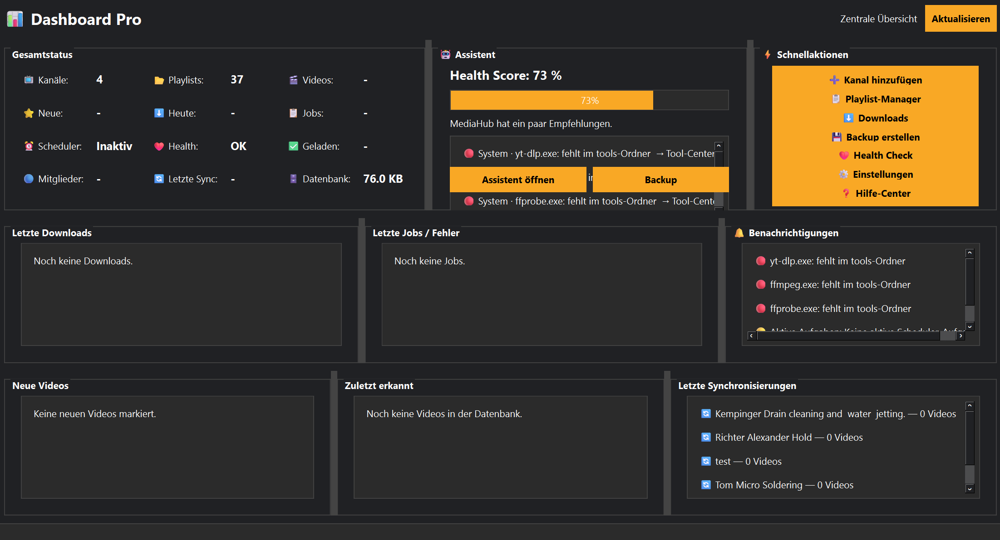

# Dashboard

## Einführung

Das Dashboard ist die zentrale Startseite von MediaHub.

Es zeigt den aktuellen Zustand des Programms und bietet Schnellzugriff auf wichtige Funktionen.

## Was zeigt das Dashboard?

Je nach Datenbestand zeigt das Dashboard Informationen zu:

- eingerichteten Kanälen
- bekannten Videos
- neuen Videos
- Downloads
- Jobs
- Scheduler
- Health-Status
- letzten Aktionen

## Schnellaktionen

Über Schnellaktionen können häufig genutzte Bereiche direkt geöffnet werden.

Typische Schnellaktionen sind:

- Kanal hinzufügen
- Playlist-Manager öffnen
- Downloads anzeigen
- Backup erstellen
- Health Check öffnen
- Einstellungen öffnen
- Hilfe öffnen

## Status und Überblick

Das Dashboard hilft dabei, sofort zu erkennen, ob MediaHub bereit ist oder ob ein Bereich Aufmerksamkeit benötigt.

## Tipps

💡 Nach dem Programmstart genügt oft ein Blick auf das Dashboard.

💡 Wenn etwas nicht funktioniert, starte von hier aus den Health Check.

## Hinweise

⚠ Das Dashboard zeigt Informationen an. Änderungen werden in den jeweiligen Bereichen vorgenommen.

## Siehe auch

- Werkzeugleiste
- Kanäle
- Downloads
- Scheduler
- Health Check
