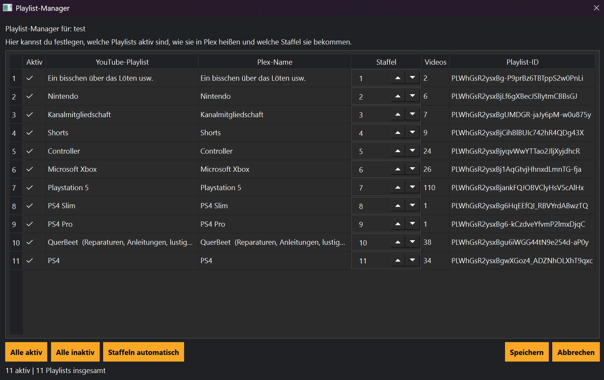

# Playlist-Manager

## Einführung

Der Playlist-Manager dient zur Verwaltung aller Playlists eines YouTube-Kanals.

MediaHub erkennt vorhandene Playlists automatisch während einer Synchronisierung und speichert diese dauerhaft in der Datenbank.

Dadurch müssen Playlists nur einmal eingelesen werden.

---

# Playlists laden

Nach einer erfolgreichen Synchronisierung können die gefundenen Playlists im Playlist-Manager angezeigt werden.

Für jede Playlist werden unter anderem folgende Informationen gespeichert:

- Name
- Anzahl der Videos
- Playlist-ID
- Synchronisationsstatus

Neue Playlists werden automatisch ergänzt.

---

# Playlists auswählen

Jede Playlist kann einzeln aktiviert oder deaktiviert werden.

Dadurch kann genau festgelegt werden, welche Playlists später berücksichtigt werden.

Beispiele:

- Nur Hörbücher
- Nur Dokumentationen
- Nur Livestreams

---

# Alle auswählen

Mit **Alle auswählen** werden sämtliche Playlists des Kanals aktiviert.

Diese Funktion eignet sich besonders nach dem erstmaligen Einrichten eines Kanals.

---

# Auswahl aufheben

Mit **Auswahl aufheben** werden alle gesetzten Haken entfernt.

Anschließend können einzelne Playlists gezielt wieder aktiviert werden.

---

# Playlists aktualisieren

Wenn auf dem YouTube-Kanal neue Playlists erstellt wurden, genügt eine erneute Synchronisierung.

MediaHub ergänzt automatisch:

- neue Playlists
- geänderte Titel
- neue Videos

Bereits bekannte Informationen bleiben erhalten.

---

# Videoauswahl

Beim Download berücksichtigt MediaHub ausschließlich Videos aus den aktivierten Playlists.

Dadurch lassen sich beispielsweise Serien, Hörbücher oder Dokumentationen getrennt verwalten.

---

# Vorteile

Der Playlist-Manager ermöglicht unter anderem:

- übersichtliche Organisation
- schnellere Synchronisierung
- gezielte Downloads
- weniger doppelte Videos

---

# Tipps

💡 Aktiviere nur die Playlists, die tatsächlich heruntergeladen werden sollen.

Dadurch verkürzt sich die Synchronisierung und die Downloadliste bleibt übersichtlich.

---

💡 Große Kanäle besitzen häufig viele Playlists.

Es lohnt sich, diese einmal sorgfältig einzurichten.

Danach arbeitet MediaHub vollständig automatisch.

---

# Hinweise

⚠ Das Deaktivieren einer Playlist löscht keine bereits heruntergeladenen Videos.

Es verhindert lediglich zukünftige Downloads aus dieser Playlist.

---

⚠ Änderungen werden erst nach dem Speichern übernommen.

---

# Siehe auch

- Kanäle
- Downloads
- Scheduler
- Bibliothek