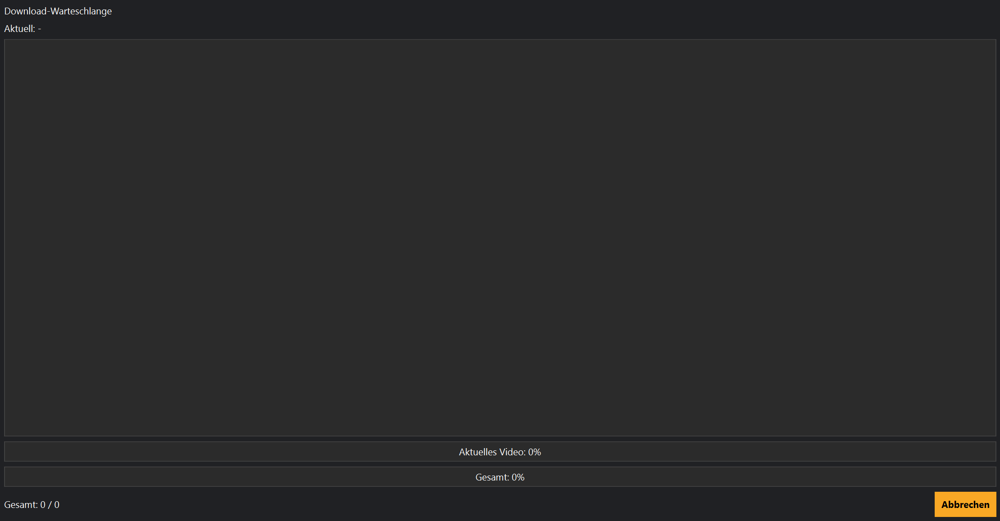

# Downloads

## Einführung

Der Download-Bereich ist das Zentrum für alle laufenden und geplanten Downloads.

Hier kannst du den Fortschritt überwachen, Downloads abbrechen und den aktuellen Status jedes Videos verfolgen.



---

# Download-Warteschlange

Alle ausgewählten Videos werden zunächst in die Download-Warteschlange übernommen.

Von dort arbeitet MediaHub die Einträge automatisch nacheinander ab.

Für jeden Eintrag werden unter anderem folgende Informationen angezeigt:

- Videotitel
- Kanal
- Playlist
- Status
- Fortschritt

Dadurch bleibt jederzeit ersichtlich, welche Downloads noch ausstehen.

---

# Download starten

Ein Download kann auf verschiedene Arten gestartet werden:

- über die Videoauswahl nach einer Synchronisierung
- über den Playlist-Manager
- automatisch durch den Scheduler
- über den Start-Assistenten

Nach dem Start übernimmt MediaHub den gesamten Ablauf automatisch.

---

# Downloadstatus

Während eines Downloads können verschiedene Status angezeigt werden.

### Wartend

Der Download befindet sich in der Warteschlange und wurde noch nicht gestartet.

### Läuft

Das Video wird aktuell heruntergeladen.

### Abgeschlossen

Der Download wurde erfolgreich beendet.

Das Video wurde im Zielordner gespeichert und in der Datenbank aktualisiert.

### Fehler

Während des Downloads ist ein Problem aufgetreten.

Mögliche Ursachen sind:

- keine Internetverbindung
- YouTube nicht erreichbar
- fehlendes Werkzeug (yt-dlp oder ffmpeg)
- ungültiger Speicherpfad

---

# Download abbrechen

Ein laufender Download kann jederzeit beendet werden.

Bereits vollständig heruntergeladene Videos bleiben erhalten.

Nicht vollständig heruntergeladene Dateien werden je nach Downloadstatus entfernt oder später erneut heruntergeladen.

---

# Automatische Downloads

MediaHub kann neue Videos automatisch herunterladen.

Dies geschieht in Verbindung mit:

- Scheduler
- Job-Queue
- Synchronisierung

Dadurch können komplette Kanäle ohne manuelles Eingreifen aktuell gehalten werden.

---

# Mitglieder-Videos

Mitglieder-Videos werden automatisch erkannt.

Sind keine gültigen Zugangsdaten vorhanden, werden diese Videos übersprungen und als Hinweis im Protokoll angezeigt.

Normale Videos werden weiterhin verarbeitet.

---

# Dateinamen

Vor dem Speichern erzeugt MediaHub den endgültigen Dateinamen anhand des eingestellten Dateinamenschemas.

Dadurch erhalten alle Downloads eine einheitliche Benennung.

Beispiele:

```
Videotitel.mp4
```

```
Videotitel (2026).mp4
```

```
Serie - S01E05.mp4
```

---

# Nach dem Download

Nach erfolgreichem Abschluss werden automatisch:

- Datenbank aktualisiert
- Downloadstatus gespeichert
- Archivinformationen geschrieben
- Bibliothek aktualisiert
- Dashboard aktualisiert

Dadurch sind alle Bereiche sofort auf dem neuesten Stand.

---

# Tipps

💡 Starte zuerst eine Synchronisierung.

Dadurch werden nur neue Videos heruntergeladen.

---

💡 Verwende möglichst einen schnellen Datenträger als Zielordner.

Große Videoarchive profitieren deutlich von SSDs.

---

💡 Kontrolliere regelmäßig die Download-Warteschlange.

Fehler werden dort sofort sichtbar.

---

# Hinweise

⚠ Während eines laufenden Downloads sollten Arbeits- und Zielordner nicht geändert werden.

---

⚠ Wird yt-dlp oder FFmpeg nicht gefunden, kann kein Download gestartet werden.

In diesem Fall hilft der **Health Check** oder das **Tool-Center**.

---

# Häufige Probleme

## Ein Download startet nicht

Prüfe:

- Internetverbindung
- Tool-Installation
- Kanal-Einstellungen
- Zielordner

---

## Ein Video wird übersprungen

Mögliche Ursachen:

- bereits vorhanden
- bereits heruntergeladen
- Mitglieder-Video
- deaktivierte Playlist

---

## Download sehr langsam

Mögliche Ursachen:

- langsame Internetverbindung
- Festplatte ausgelastet
- YouTube begrenzt die Geschwindigkeit

---

# Siehe auch

- Kanäle
- Playlist-Manager
- Scheduler
- Bibliothek
- Health Check