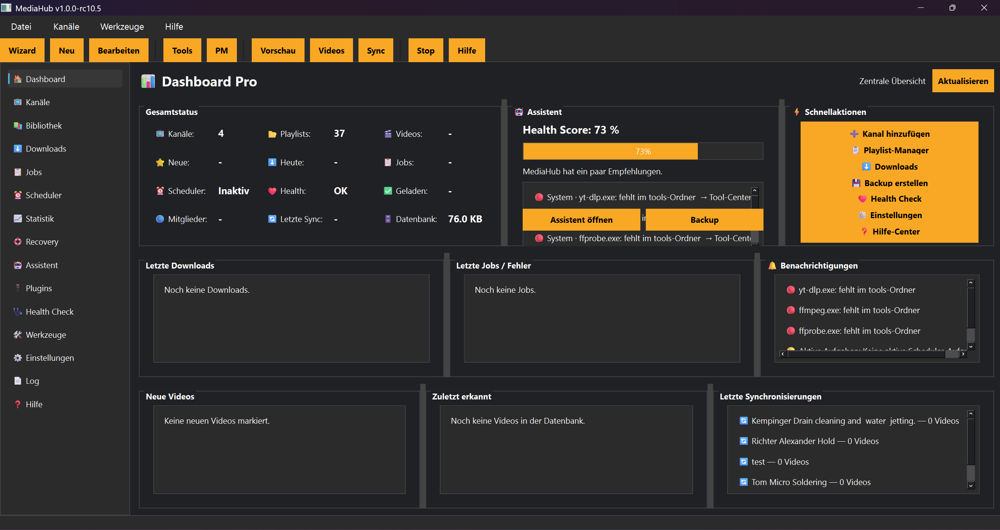

# Werkzeugleiste

## Einführung

Die Werkzeugleiste befindet sich oben im Hauptfenster und enthält die wichtigsten Funktionen für die tägliche Arbeit.

## Buttons der Werkzeugleiste

Die Werkzeugleiste enthält folgende Schaltflächen:

### Wizard

Öffnet den Start-Assistenten.

Dieser Button ist besonders für neue Kanäle wichtig.

### Neu

Legt einen neuen Kanal an.

### Tools

Öffnet das Tool-Center.

Dort können externe Werkzeuge geprüft und verwaltet werden.

### PM

Öffnet den Playlist-Manager.

### Vorschau

Lädt eine Vorschau für den aktuellen Kanal.

Die Vorschau öffnet kein eigenes Fenster. Der Fortschritt wird in der Statusleiste angezeigt.

### Videos

Öffnet die Videoauswahl.

### Sync

Startet die Synchronisierung des aktuellen Kanals.

### Stop

Bricht einen laufenden Download ab.

### Hilfe

Öffnet das Hilfe-Center.

## Tipps

💡 Die Werkzeugleiste ist der schnellste Weg zu den wichtigsten Funktionen.

💡 Für neue Benutzer sind besonders **Wizard**, **Tools**, **PM**, **Sync** und **Videos** wichtig.

## Hinweise

⚠ Einige Buttons funktionieren nur, wenn ein Kanal ausgewählt ist.

⚠ Stop wirkt nur auf laufende Downloads.

## Siehe auch

- Menüleiste
- Start-Assistent
- Tool-Center
- Videoauswahl
