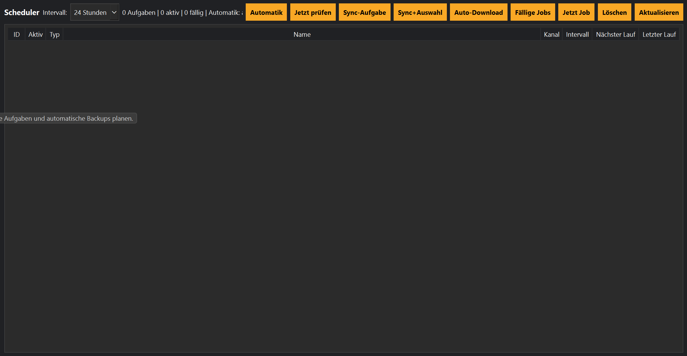

# Scheduler

## Einführung

Der Scheduler übernimmt die automatische Ausführung wiederkehrender Aufgaben.

Dadurch kann MediaHub Kanäle selbstständig synchronisieren, neue Videos erkennen und – je nach Einstellung – sofort herunterladen.

---

# Warum ein Scheduler?

Wer mehrere Kanäle verwaltet, möchte nicht jeden Tag manuell nach neuen Videos suchen.

Der Scheduler übernimmt diese Aufgabe automatisch.

Typische Anwendungsfälle sind:

- tägliche Synchronisierung
- automatische Downloads
- regelmäßige Aktualisierung der Bibliothek
- unbeaufsichtigter Betrieb

---

# Neue Aufgabe erstellen

Über den Scheduler können verschiedene Aufgaben angelegt werden.

Zur Verfügung stehen unter anderem:

- Synchronisierung
- Synchronisierung + Download
- Synchronisierung + Auto-Download

Beim Erstellen einer Aufgabe wird festgelegt:

- welcher Kanal verwendet wird
- wann die Aufgabe ausgeführt wird
- wie oft sie wiederholt werden soll

---

# Synchronisierung

Bei einer Synchronisierung sucht MediaHub nach neuen Videos.

Neue Videos werden in die Datenbank übernommen.

Es werden dabei noch keine Downloads gestartet.

Diese Variante eignet sich besonders, wenn neue Videos zunächst geprüft werden sollen.

---

# Synchronisierung + Download

Nach der Synchronisierung öffnet MediaHub automatisch die Videoauswahl.

Dadurch kann entschieden werden, welche Videos tatsächlich heruntergeladen werden.

Diese Variante bietet maximale Kontrolle.

---

# Synchronisierung + Auto-Download

Diese Aufgabe arbeitet vollständig automatisch.

Der Ablauf:

1. Kanal synchronisieren
2. Neue Videos erkennen
3. Bereits bekannte Videos überspringen
4. Neue Videos automatisch herunterladen
5. Bibliothek aktualisieren

Der Benutzer muss nicht eingreifen.

---

# Wiederholungen

Jede Aufgabe kann regelmäßig ausgeführt werden.

Beispiele:

- täglich
- wöchentlich
- monatlich
- alle 6 Stunden
- alle 12 Stunden

Dadurch bleibt die Mediensammlung automatisch aktuell.

---

# Job-Queue

Der Scheduler startet keine Downloads direkt.

Stattdessen werden neue Aufgaben an die Job-Queue übergeben.

Die Job-Queue verarbeitet diese anschließend in der richtigen Reihenfolge.

Dadurch können mehrere Aufgaben hintereinander ausgeführt werden.

---

# Automatischer Betrieb

MediaHub kann über längere Zeit unbeaufsichtigt laufen.

Währenddessen übernimmt der Scheduler automatisch:

- Synchronisierung
- Download
- Aktualisierung der Bibliothek
- Aktualisierung des Dashboards

---

# Beispiele

## Jeden Abend

18:00 Uhr

Synchronisierung aller Kanäle

---

## Jeden Sonntag

08:00 Uhr

Synchronisierung + Download

---

## Alle sechs Stunden

Synchronisierung + Auto-Download

Ideal für Nachrichten- oder Technikkanäle.

---

# Tipps

💡 Lege für häufig aktualisierte Kanäle kürzere Intervalle fest.

---

💡 Für selten aktualisierte Kanäle genügt meist eine tägliche Synchronisierung.

---

💡 Nutze Auto-Download nur für Kanäle, deren Inhalte immer automatisch gespeichert werden sollen.

---

# Hinweise

⚠ Werden mehrere Aufgaben gleichzeitig fällig, übernimmt die Job-Queue die Reihenfolge.

---

⚠ Während einer Synchronisierung sollte MediaHub nicht beendet werden.

---

# Häufige Probleme

## Aufgabe wird nicht ausgeführt

Prüfen:

- Scheduler aktiviert?
- Aufgabe aktiviert?
- Uhrzeit korrekt?
- Kanal vorhanden?

---

## Keine neuen Videos gefunden

Das bedeutet meist:

- keine neuen Videos vorhanden
- Kanal bereits aktuell
- alle Videos bereits bekannt

---

# Siehe auch

- Downloads
- Job-Queue
- Kanäle
- Bibliothek
- Recovery Center