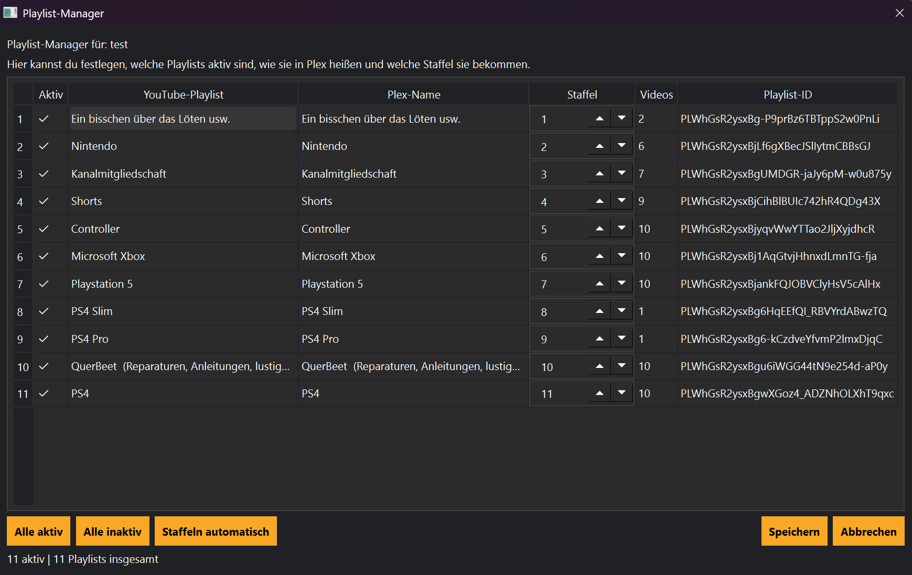

# Playlist-Manager

Der Playlist-Manager zeigt alle gefundenen Playlists eines Kanals.

## Möglichkeiten

- Playlists aktivieren
- Playlists deaktivieren
- Aktualisieren
- Mehrfachauswahl

## Tipp

💡 Änderungen wirken sich auf zukünftige Synchronisierungen aus.
