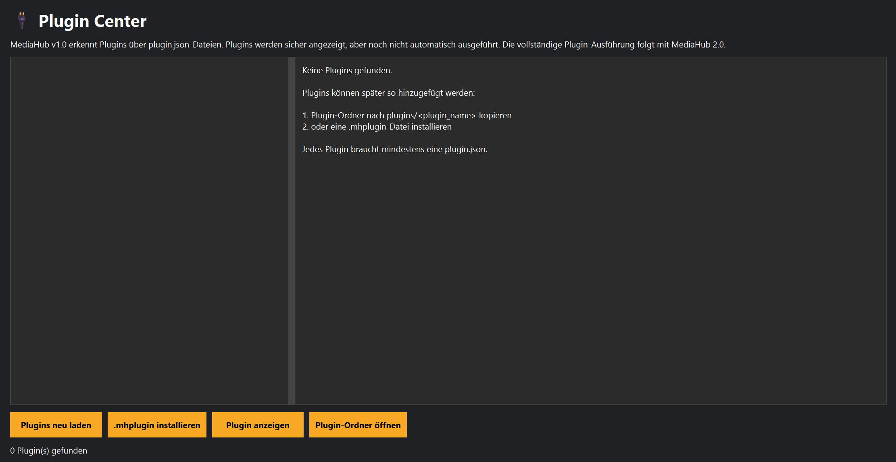

# Plugin Center

## Einführung

Das Plugin Center ermöglicht die Verwaltung und Erweiterung von MediaHub durch zusätzliche Module.

Plugins erweitern MediaHub um neue Funktionen, ohne dass das Hauptprogramm geändert werden muss.



---

# Was sind Plugins?

Plugins sind eigenständige Erweiterungen.

Jedes Plugin besitzt seinen eigenen Ordner und kann unabhängig vom Hauptprogramm aktualisiert werden.

Ein Plugin besteht in der Regel aus:

- plugin.json
- plugin.py
- help.md
- Symbol (optional)

Dadurch bleibt MediaHub modular aufgebaut.

---

# Plugin Center

Im Plugin Center werden alle gefundenen Plugins angezeigt.

Zu jedem Plugin werden Informationen wie Name, Version und Beschreibung dargestellt.

Außerdem kann eingesehen werden, ob das Plugin korrekt geladen wurde.

---

# Plugin-Informationen

Für jedes Plugin können unter anderem folgende Informationen angezeigt werden:

- Name
- Version
- Autor
- Beschreibung
- Status
- Hilfe

Dadurch erhältst du schnell einen Überblick über alle installierten Erweiterungen.

---

# Plugin-Hilfe

Jedes Plugin kann eine eigene Hilfe mitbringen.

Diese wird automatisch in das Hilfe-Center übernommen.

Dadurch muss das Benutzerhandbuch nicht angepasst werden, wenn neue Plugins installiert werden.

---

# Plugin-Ordner

Alle Plugins befinden sich im Ordner:

```
plugins/
```

Jedes Plugin besitzt dort seinen eigenen Unterordner.

---

# Vorteile

Das Plugin-System ermöglicht:

- einfache Erweiterungen
- unabhängige Updates
- eigene Dokumentation
- bessere Wartbarkeit

---

# Tipps

💡 Installiere Plugins nur aus vertrauenswürdigen Quellen.

---

💡 Prüfe regelmäßig, ob Aktualisierungen verfügbar sind.

---

# Hinweise

⚠ Das Löschen eines Plugins entfernt dessen Funktionen aus MediaHub.

---

⚠ Einige Plugins benötigen zusätzliche Programme oder Bibliotheken.

---

# Siehe auch

- Hilfe-Center
- Einstellungen
- Recovery Center