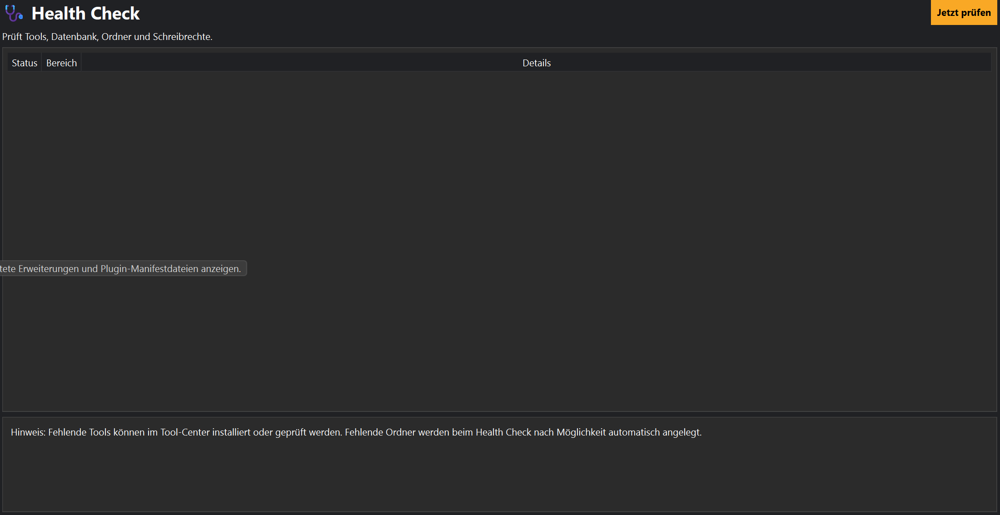

# Health Check

## Einführung

Der Health Check überprüft automatisch den Zustand deiner MediaHub-Installation.

Mit nur einem Klick kontrolliert MediaHub alle wichtigen Komponenten und zeigt sofort an, ob Probleme erkannt wurden.

Dadurch lassen sich viele Fehler bereits erkennen, bevor sie beim Arbeiten auffallen.



---

# Was wird überprüft?

Der Health Check kontrolliert unter anderem:

- Datenbank
- Konfigurationsdateien
- Dokumentation
- Plugin-Verzeichnis
- Download-Ordner
- Arbeitsordner
- Schreibrechte
- yt-dlp
- FFmpeg
- FFprobe
- Deno
- Scheduler
- Job-Queue

Jeder Punkt wird einzeln ausgewertet.

---

# Statusanzeigen

MediaHub verwendet verschiedene Status.

## Grün

Alles ist in Ordnung.

Es besteht kein Handlungsbedarf.

---

## Gelb

Es wurde eine Warnung erkannt.

Die Funktion arbeitet möglicherweise noch, sollte aber überprüft werden.

---

## Rot

Ein Fehler verhindert die korrekte Funktion.

Dieser sollte möglichst zeitnah behoben werden.

---

# Werkzeuge

Der Health Check kontrolliert automatisch die installierten Programme.

Zum Beispiel:

- yt-dlp
- FFmpeg
- FFprobe
- Deno

Fehlende Programme werden deutlich angezeigt.

---

# Datenbank

Die Datenbank wird auf grundlegende Fehler geprüft.

Dabei kontrolliert MediaHub unter anderem:

- Erreichbarkeit
- Struktur
- wichtige Tabellen

---

# Ordner

Folgende Ordner werden geprüft:

- Downloads
- Arbeitsordner
- Dokumentation
- Plugins
- Logs
- Konfiguration

Außerdem überprüft MediaHub die Schreibrechte.

---

# Dokumentation

Auch die integrierte Dokumentation wird überprüft.

Fehlende Dateien werden im Bericht angezeigt.

Dadurch fällt sofort auf, wenn beispielsweise das Handbuch noch nicht erzeugt wurde.

---

# Tipps

💡 Führe den Health Check nach einer Neuinstallation einmal vollständig aus.

---

💡 Nach größeren Updates empfiehlt sich ebenfalls eine Überprüfung.

---

💡 Bei Problemen sollte der Health Check immer der erste Schritt sein.

---

# Hinweise

⚠ Nicht jede Warnung bedeutet einen Fehler.

Beispielsweise können optionale Programme fehlen, ohne dass MediaHub dadurch unbrauchbar wird.

---

# Häufige Probleme

## yt-dlp fehlt

Öffne das Tool-Center und installiere oder aktualisiere yt-dlp.

---

## FFmpeg fehlt

Installiere FFmpeg über das Tool-Center.

---

## Datenbank nicht erreichbar

Prüfe den Datenbankpfad und die Schreibrechte.

---

## Dokumentation fehlt

Führe aus:

```text
python build_docs.py
```

Dadurch werden alle Dokumente neu erstellt.

---

# Siehe auch

- Recovery Center
- Einstellungen
- Tool-Center
- Hilfe-Center