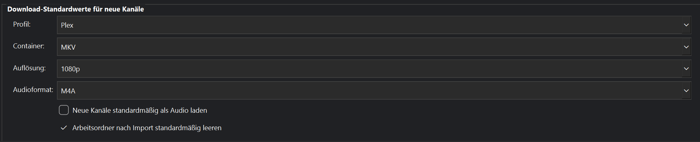
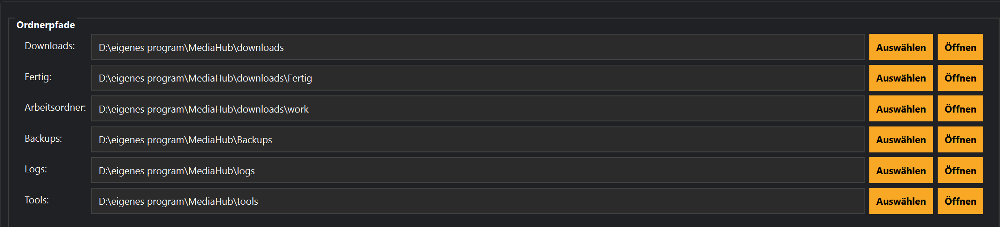
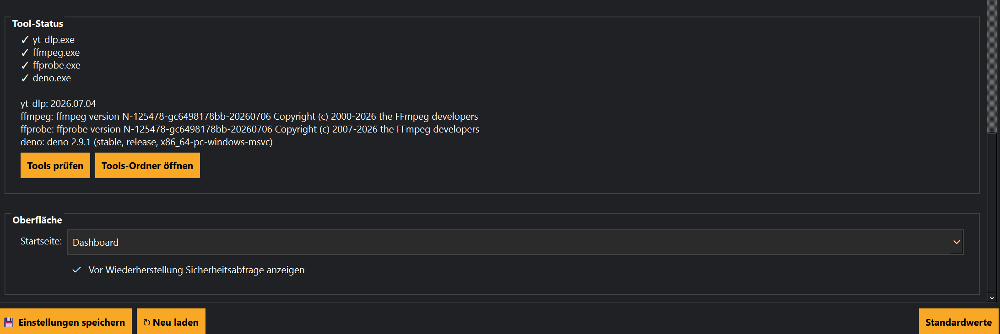

# Einstellungen

## Einführung

Im Bereich **Einstellungen** werden alle globalen Optionen von MediaHub verwaltet.

Hier legst du unter anderem Programmverhalten, Standardpfade und verschiedene Systemoptionen fest.

Da dieser Bereich sehr umfangreich ist, wird er in drei Abschnitte unterteilt.

---

# Allgemeine Einstellungen

Im ersten Bereich befinden sich die allgemeinen Programmeinstellungen.

Hier können unter anderem folgende Optionen angepasst werden:

- Grundeinstellungen
- Standardwerte
- Programmverhalten
- Benutzeroptionen

Diese Einstellungen gelten für die gesamte MediaHub-Installation.

---

# Download- und Speicherorte

Hier werden sämtliche Verzeichnisse festgelegt.

Dazu gehören beispielsweise:

- Downloadordner
- Arbeitsordner
- Zielordner
- Dokumentationsordner
- Backupordner
- Pluginordner

Es empfiehlt sich, diese Ordner bereits bei der ersten Einrichtung sorgfältig festzulegen.

---

# Erweiterte Einstellungen

Der dritte Bereich enthält weiterführende Optionen.

Je nach installierten Funktionen können hier unter anderem folgende Einstellungen vorhanden sein:

- Scheduler
- Plugins
- Datenbank
- Assistent
- Entwickleroptionen
- Diagnosefunktionen

Diese Einstellungen sind hauptsächlich für erfahrene Benutzer gedacht.

---

# Änderungen speichern

Nach jeder Änderung sollten die Einstellungen gespeichert werden.

Einige Änderungen werden sofort übernommen.

Andere Einstellungen werden erst nach einem Neustart von MediaHub aktiv.

---

# Standardwerte

Viele Einstellungen besitzen sinnvolle Standardwerte.

Diese können jederzeit wiederhergestellt werden.

Dadurch lässt sich eine fehlerhafte Konfiguration schnell zurücksetzen.

---

# Tipps

💡 Ändere nur Einstellungen, deren Funktion bekannt ist.

---

💡 Lege Arbeits- und Downloadordner möglichst auf eine schnelle SSD.

---

💡 Erstelle vor größeren Änderungen ein Backup über das Recovery Center.

---

# Hinweise

⚠ Einige Änderungen wirken sich auf alle Kanäle aus.

---

⚠ Während laufender Downloads sollten wichtige Einstellungen nicht geändert werden.

---

# Häufige Probleme

## Ordner wird nicht gefunden

Prüfe:

- Schreibweise
- Laufwerksbuchstaben
- Zugriffsrechte

---

## Änderungen werden nicht übernommen

Speichere zunächst die Einstellungen.

Falls erforderlich, starte MediaHub anschließend neu.

---

## Programm startet nicht mehr

Stelle die letzte Sicherung über das Recovery Center wieder her.

---

# Siehe auch

- Recovery Center
- Health Check
- Kanäle
- Downloads
- Hilfe-Center