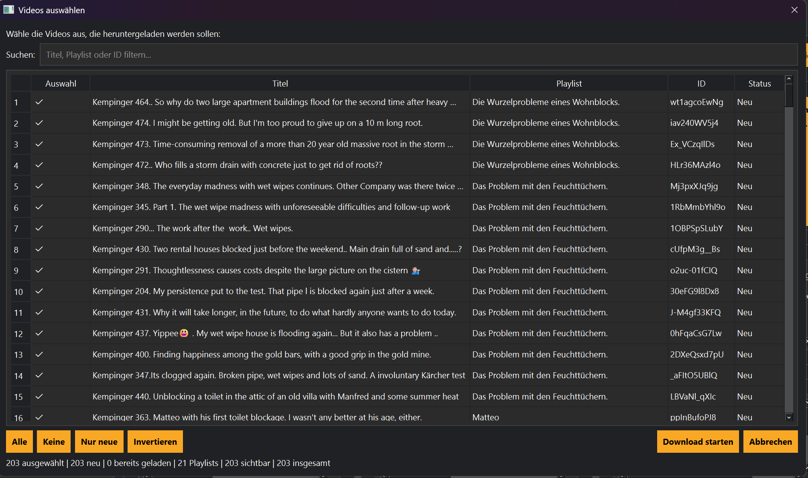

# Videoauswahl

Nach der Synchronisierung oder dem Start-Assistenten kann ausgewählt werden, welche Videos heruntergeladen werden.

## Funktionen

- Alle auswählen
- Auswahl aufheben
- Einzelne Videos markieren
- Download starten
