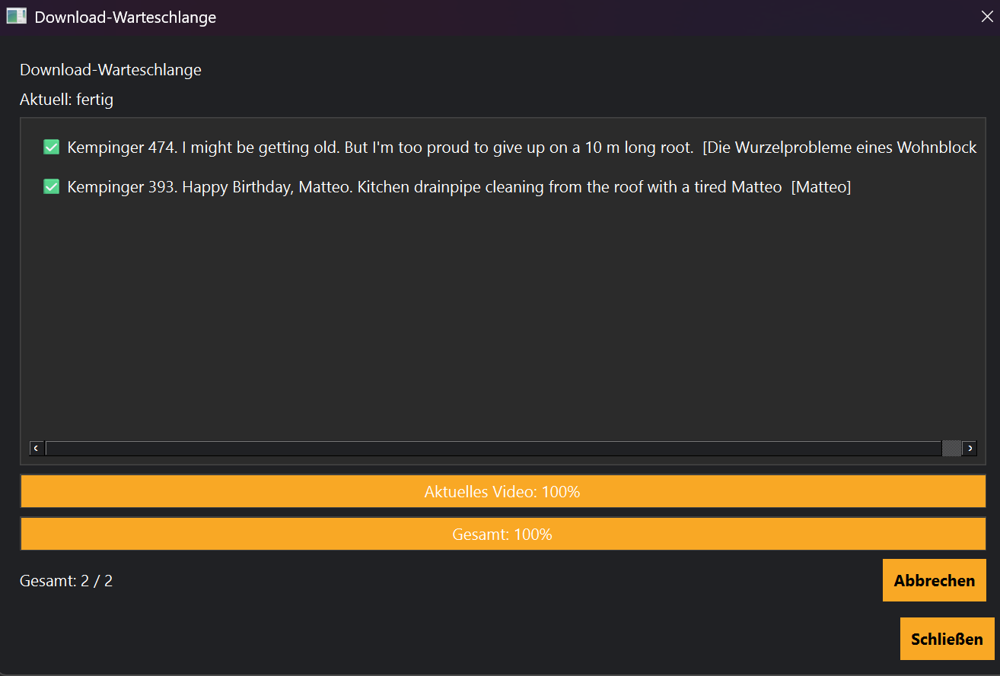

# Downloads

Hier werden alle laufenden und geplanten Downloads angezeigt.

## Informationen

- Fortschritt
- Status
- Geschwindigkeit
- Restzeit

Über **Stop** kann ein laufender Download abgebrochen werden.

## Siehe auch

- Job-Queue
- Bibliothek
