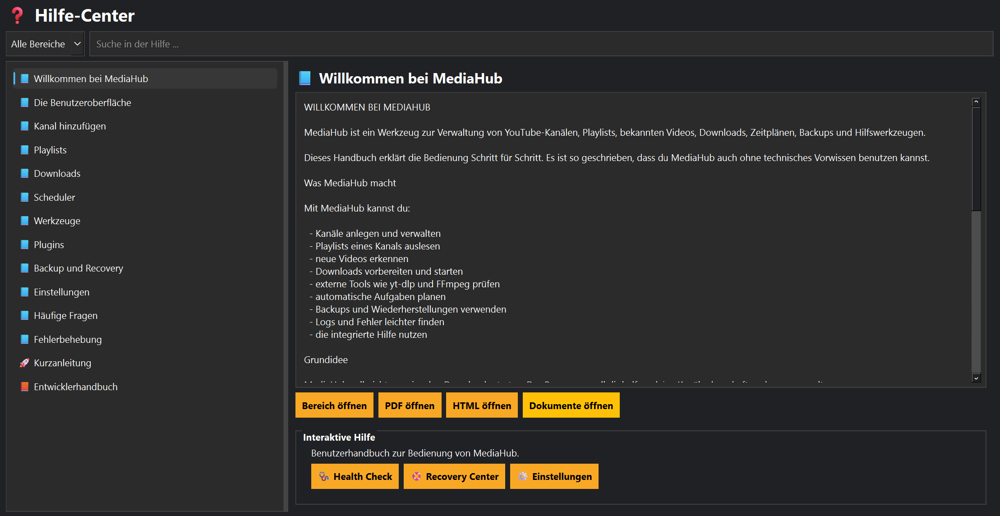

# Hilfe-Center

## Einführung

Das Hilfe-Center ist die zentrale Anlaufstelle für alle Fragen rund um MediaHub.

Es bündelt das Benutzerhandbuch, die Entwicklerdokumentation sowie die Hilfe installierter Plugins in einer gemeinsamen Oberfläche.

---

# Suche

Über das Suchfeld können Begriffe direkt gesucht werden.

Die Suche durchsucht unter anderem:

- Benutzerhandbuch
- Entwicklerhandbuch
- Plugin-Hilfe
- Stichwörter

Bereits während der Eingabe werden passende Themen angezeigt.

---

# Kategorien

Die Hilfe ist in verschiedene Bereiche gegliedert.

Dazu gehören:

- Schnellstart
- Benutzerhandbuch
- Entwicklerhandbuch
- Plugins

Über den Filter kann gezielt in einem Bereich gesucht werden.

---

# Hilfe öffnen

Zu jedem Thema wird die passende Beschreibung angezeigt.

Zusätzlich können – sofern vorhanden – weitere Dokumente geöffnet werden.

Beispielsweise:

- PDF-Handbuch
- HTML-Version
- Dokumentationsordner

---

# Interaktive Hilfe

Einige Themen besitzen direkte Verknüpfungen.

Über **Bereich öffnen** kann unmittelbar zum entsprechenden Programmteil gewechselt werden.

Dadurch entfällt langes Suchen in der Navigation.

---

# Plugin-Hilfe

Installierte Plugins können eigene Hilfeseiten bereitstellen.

Diese werden automatisch erkannt und in das Hilfe-Center integriert.

Eine zusätzliche Konfiguration ist nicht erforderlich.

---

# Tipps

💡 Nutze zuerst die Suche. Häufig findest du die gesuchte Information innerhalb weniger Sekunden.

---

💡 Mit der Taste **F1** öffnest du direkt das Hilfe-Center.

---

# Hinweise

⚠ Die Hilfe wird aus den aktuellen Dokumentationsdateien erzeugt.

Nach Änderungen sollte daher `python build_docs.py` ausgeführt werden.

---

# Siehe auch

- Einstellungen
- Plugin Center
- FAQ
- Fehlerbehebung