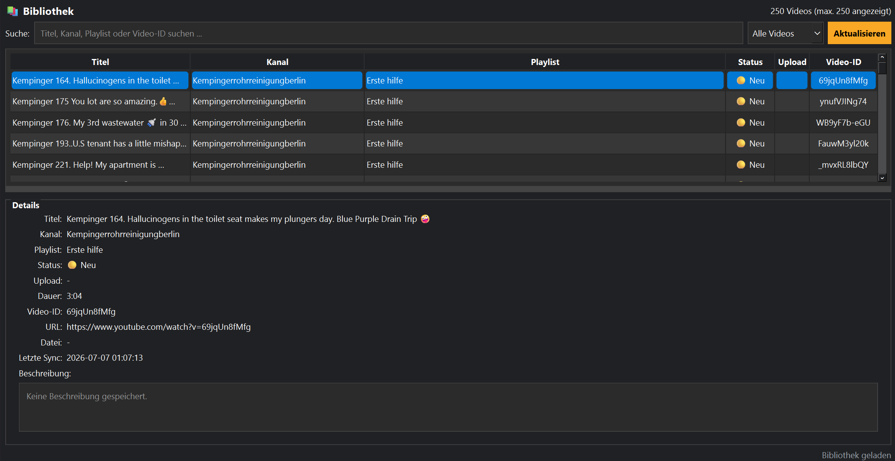

# Bibliothek

## Einführung

Die Bibliothek enthält alle bereits bekannten und heruntergeladenen Videos.

## Funktionen

- Videos durchsuchen
- Filtern
- Sortieren
- Details anzeigen
- Einträge aktualisieren

## Tipps

💡 Die Bibliothek ist das zentrale Archiv deiner Medien.

## Siehe auch

- Downloads
- Synchronisierung
