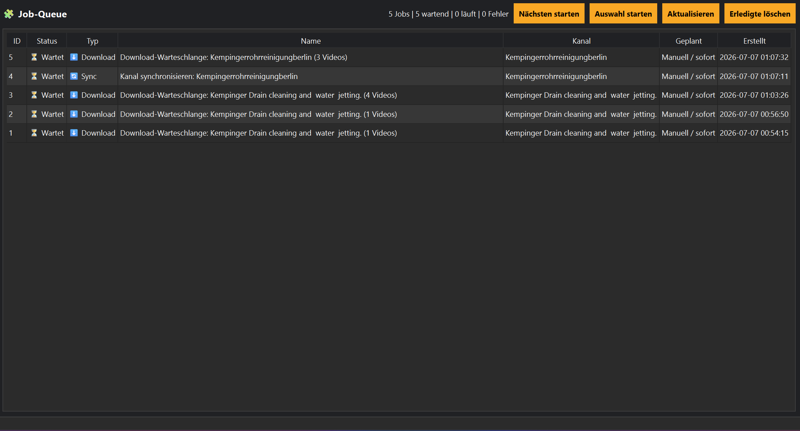

# Job-Queue

Die Job-Queue verwaltet alle geplanten Aufgaben.

## Beispiele

- Synchronisierung
- Download
- Tool-Prüfung
- Scheduler-Aufträge

Jeder Job besitzt einen Status und wird der Reihe nach abgearbeitet.
