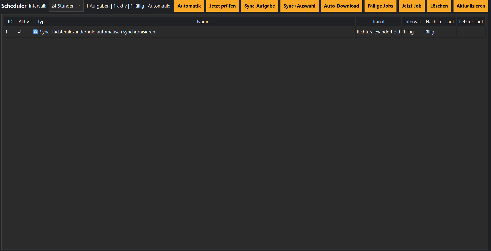

# Scheduler

Mit dem Scheduler können Aufgaben automatisch ausgeführt werden.

## Mögliche Aufgaben

- Kanal synchronisieren
- Synchronisieren und herunterladen
- Tool-Prüfung
- Health Check

## Optionen

- Einmalig
- Täglich
- Wöchentlich
- Benutzerdefiniert

💡 Der Scheduler arbeitet mit der Job-Queue zusammen.
