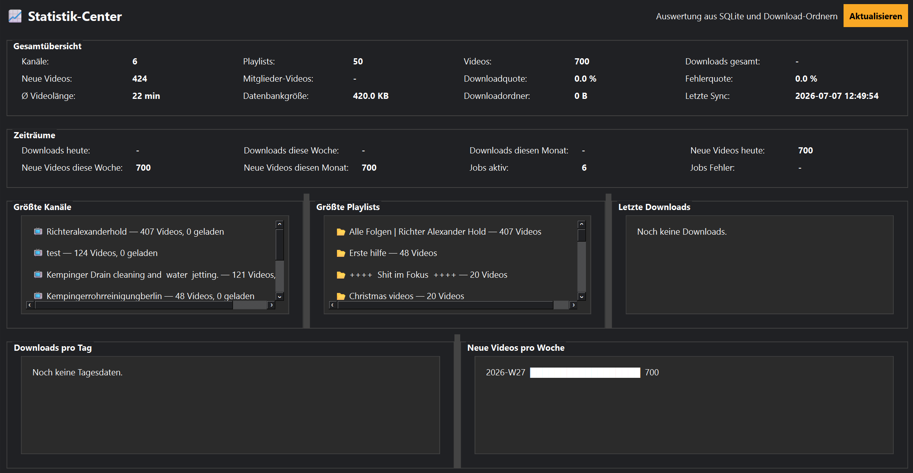

# Statistik

Die Statistik zeigt einen Überblick über die Nutzung von MediaHub.

## Mögliche Informationen

- Anzahl der Kanäle
- Videos
- Downloads
- Speicherplatz
- Synchronisierungen

Die Statistik hilft dabei, die Entwicklung der Mediensammlung im Blick zu behalten.
