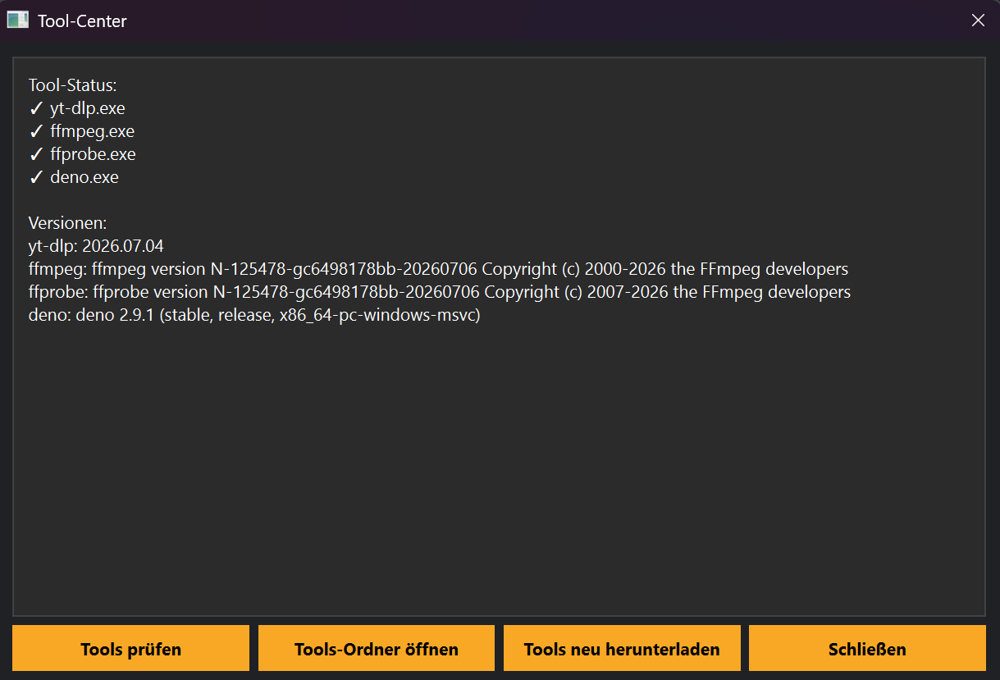

# Tool-Center

## Einführung

Im Tool-Center verwaltet MediaHub alle externen Programme.

## Funktionen

- Tools prüfen
- Installieren
- Aktualisieren
- Versionen anzeigen
- Status kontrollieren

## Unterstützte Werkzeuge

- yt-dlp
- FFmpeg

💡 Vor dem ersten Download sollte eine Tool-Prüfung durchgeführt werden.
