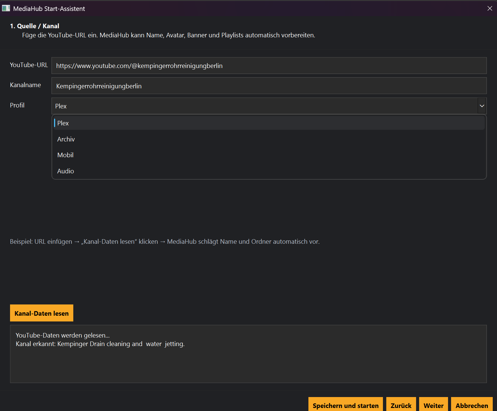
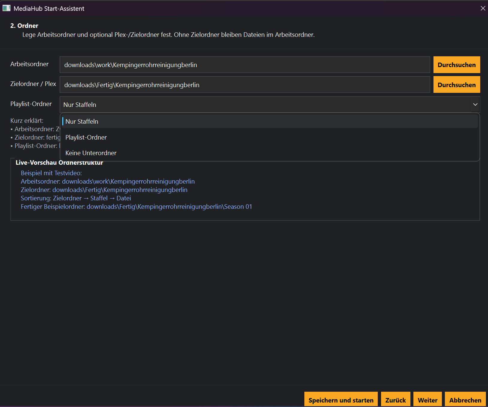
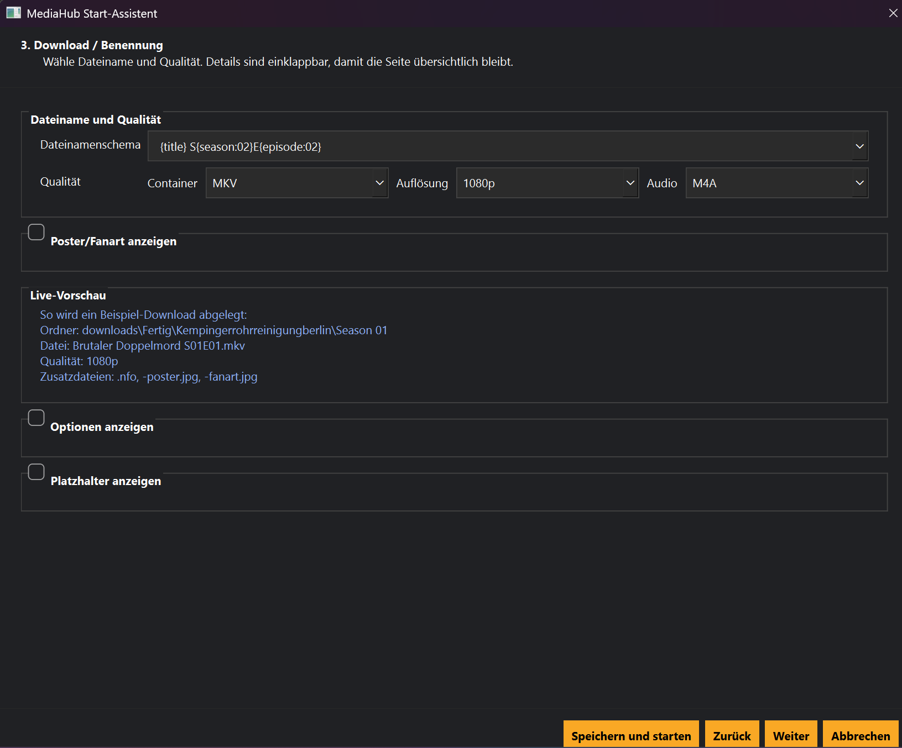
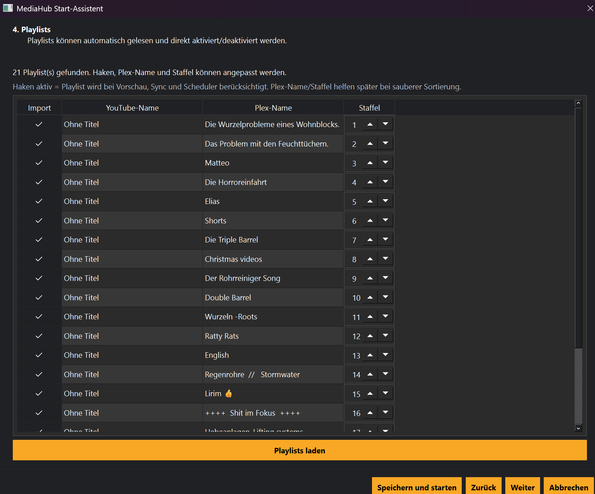
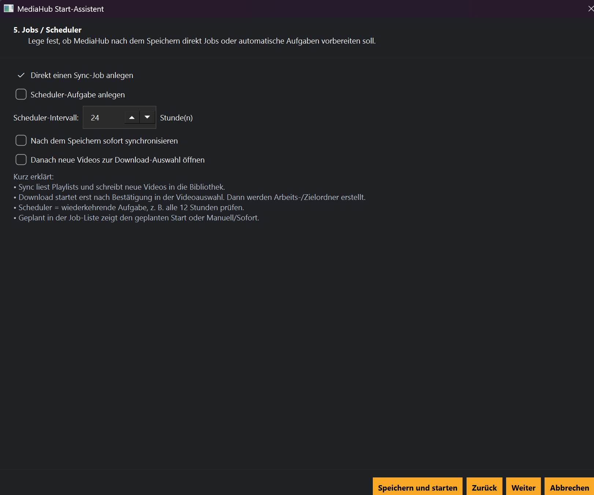
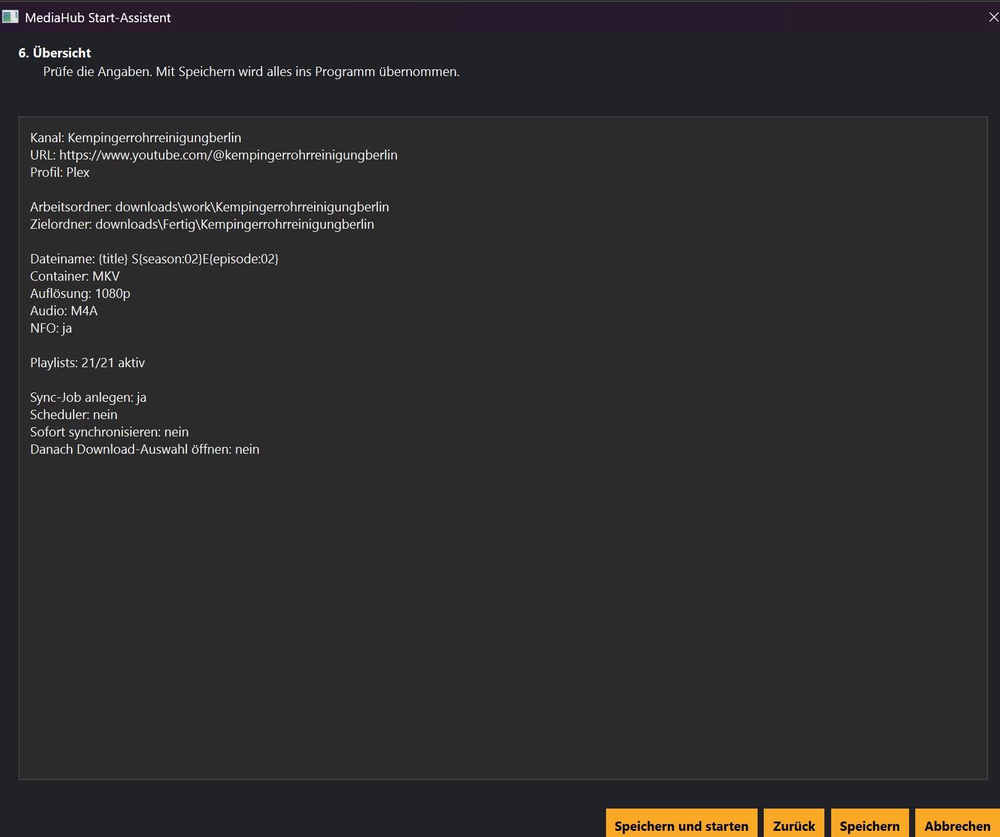

# MediaHub-Assistent

## Einführung

Der Assistent begleitet dich Schritt für Schritt durch die Einrichtung eines neuen Kanals.

### Schritt 1 – Kanaldaten lesen

URL eingeben und Kanaldaten laden.

### Schritt 2 – Playlists auswählen

Playlists übernehmen oder abwählen.

### Schritt 3 – Übersicht

Alle Einstellungen kontrollieren.

Weitere Ansichten:

- Poster/Fanart
- Optionen
- Platzhalter

### Schritt 4

Weitere Einstellungen vornehmen.

### Schritt 5

Abschluss vorbereiten.

### Abschluss

Jetzt kann gespeichert oder **Speichern und starten** gewählt werden. Danach folgen Video-Mengenauswahl, Videoauswahl und Download.
